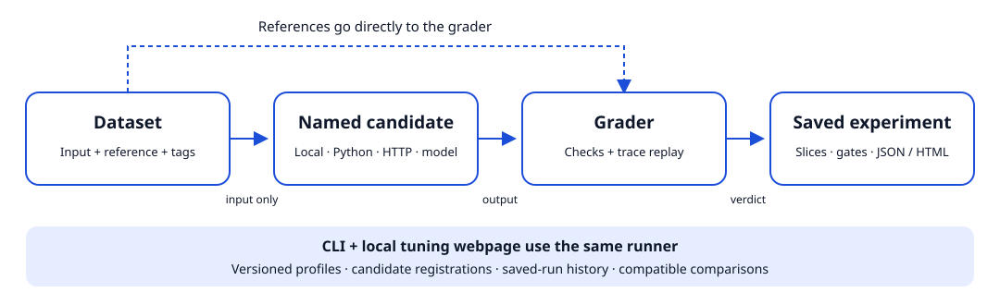

# Practical Eval Lab

Six runnable evaluation examples with a local tuning webpage. Learn how to choose
success criteria, inspect failures, compare application versions, and keep the
results reproducible. Every example works without an API key.

**Status:** a public, open-source educational toolkit. Original code and synthetic
data use [MIT-0](LICENSE).
The human-preference sample retains its [upstream MIT notice](THIRD_PARTY_NOTICES.md).

[Explore recorded results](https://hk-775.github.io/practical-eval-lab/) ·
[Read the six walkthroughs](https://hk-775.github.io/practical-eval-lab/guides.html) ·
[Learn from public incidents](https://hk-775.github.io/practical-eval-lab/incidents.html)

[Agent guide](https://hk-775.github.io/practical-eval-lab/llms.txt) ·
[Download documentation context](https://hk-775.github.io/practical-eval-lab/agent-context.txt) ·
[Read code with GitIngest](https://gitingest.com/hk-775/practical-eval-lab)

The GitHub Pages site lets you inspect actual offline runs and download evidence.
Run the local lab below to edit cases, execute candidates, and save experiments.

## Start in a source checkout

Use Python 3.10+ and [uv](https://docs.astral.sh/uv/):

```bash
git clone https://github.com/hk-775/practical-eval-lab.git
cd practical-eval-lab
uv sync --locked
uv run --locked eval-lab serve
```

Open <http://127.0.0.1:8000>. Choose an example and click **Compare candidates**.
Edit development cases, references, grading settings, or the passing threshold;
then rerun and save the profile. Stop the server with Ctrl+C.

For an occupied port: `uv run --locked eval-lab serve --port 8766`.
The dependency-free source workflow also works with `python -m eval_lab serve`.
The original `server.py` and `eval.py` entry points remain available.

[See the tuning webpage](docs/images/tuning-lab.png).

## Choose a lesson

| Example | Skill demonstrated | Dev / holdout | Walkthrough |
|---|---|---:|---|
| Classification | Accuracy, confusion matrix, macro-F1, slice analysis | 20 / 10 | [Classify tickets](examples/classification.md) |
| Structured extraction | Schema validity versus field correctness | 20 / 10 | [Extract orders](examples/extraction.md) |
| Tool calling | Tool selection, arguments, outcomes, regressions | 20 / 10 | [Evaluate a tool decision](examples/tool-calling.md) |
| RAG | Retrieval recall, reference answers, citation evidence, abstention | 8 / 4 | [Retrieve and answer](examples/rag.md) |
| Response quality | Rubrics, blinded pairwise judging, agreement with human preferences | 6 / 6 | [Calibrate a judge](examples/response-quality.md) |
| Multi-step agent | Trace replay, authorization, retries, budgets, task completion | 8 / 4 | [Evaluate a workflow](examples/agent.md) |

The 126 cases are teaching material: 114 synthetic cases and 12 attributed human
preference pairs. Built-in candidates are local rules, not trained models. The
candidate named `improved` describes an intended change, not a promise of better
results. Its response-quality holdout score actually regresses.

[Recorded JSON/HTML experiments](examples/results/README.md) ·
[Learning guide](docs/learning-guide.md) ·
[Public incidents and proposed evals](docs/incident-case-studies.md)

## Inspect a decision model diagnostic

The separate [decision-model benchmark](benchmarks/decision_models/README.md)
compares pinned Strands Decider and Laya checkpoints on frozen synthetic routing,
tool-selection, and policy cases. It records calibration, accuracy, abstention,
failures, latency, and explicit cost assumptions. Model dependencies have a
separate uv lockfile. Jev is optional and requires an API key; an unexecuted
adapter contributes no performance results.

[Read the recorded model results](benchmarks/decision_models/recordings/README.md),
including failure slices and the raw calibration and holdout evidence.
The [design review](benchmarks/decision_models/DESIGN_REVIEW.md) explains why
this initial fixture cannot support a general Strands-versus-Laya ranking.

## Evaluate your application

Compare two named Python candidates without modifying the runner:

```bash
uv run --locked eval-lab compare --suite classification \
  --project examples/python-project.json --before app-v1 --after app-v2 \
  --report reports/application.json --html reports/application.html
```

Expose those registrations in the webpage:

```bash
uv run --locked eval-lab serve --project examples/python-project.json
```

A complete local HTTP application and endpoint configurations are included too.
The [integration guide](docs/integrations.md) covers Python, HTTP, optional OpenAI
calls, environment-based credentials, and replacing the demonstration application.
A project file is trusted executable configuration; the browser cannot register
arbitrary code or endpoints.

## Save and compare evidence

The webpage saves every run and comparison automatically. Reopen saved experiments,
import JSON reports, compare compatible saved runs, and export standalone HTML.
Reports include case-level outputs, grader checks, slices, gate decisions, candidate
identity, fingerprints, candidate/grader timing, and token usage when supplied.

```bash
uv run --locked eval-lab compare --suite rag \
  --report reports/rag.json --html reports/rag.html
uv run --locked eval-lab export reports/rag.json --html reports/rag.html
uv run --locked eval-lab run --suite response_quality --candidate improved --trials 3
```

Repeated trials expose variability on the same cases; they are not independent
new test examples. No estimated costs or statistical significance are inferred.

Source-checkout state lives in ignored `local/`: `profiles/`, profile `history/`,
and saved `runs/`. Installed packages use a writable per-user directory. Override
with `--state-dir PATH` or `EVAL_LAB_HOME`. The CLI uses bundled cases unless given
`--config` or `--cases`; it never silently loads webpage edits.

## Block a regression in CI

```bash
uv run --locked eval-lab compare --suite tool_calling --split holdout \
  --fail-on-regression --critical-tag vocabulary --min-slice lookup=1
```

This intentionally exits **1** despite the average improving from 50% to 80%:
one lookup regresses, and critical/slice checks fail. Quality gates apply to the
candidate after the change; execution failures in either candidate remain errors.

| Exit | Meaning |
|---:|---|
| 0 | Quality gates pass and candidates executed successfully |
| 1 | Quality or regression gate failed |
| 2 | Invalid configuration, incompatible comparison, or file error |
| 3 | At least one candidate execution failed |

## Install a built artifact

```bash
uv build
uv tool install ./dist/practical_eval_lab-0.2.0-py3-none-any.whl
eval-lab serve
```

This installs an artifact you build locally. No registry package or GitHub Release
is claimed. Wheels contain the webpage, datasets, provenance, and license notices.
Wheel and source-distribution installs are exercised outside the checkout in CI.

## Verify and extend

```bash
uv sync --locked
uv run --locked pytest -q
uv run --locked playwright install chromium
uv run --locked python -m scripts.browser_check
uv run --locked python -m scripts.package_check
uv run --locked python -m scripts.reproduce_portfolio
```

CI covers Python 3.10 and 3.14 on Ubuntu and Python 3.13 on Ubuntu, Windows, and macOS, with
Chromium checks on Ubuntu. Tests exercise grader failure paths, real loopback HTTP
integration, report persistence/import, gates, packaging, and the six webpage flows.
The optional OpenAI adapter is tested with a mock response; no paid live call has
been used to substantiate the bundled results.



[Contracts and extension points](docs/contracts.md) · [Data provenance](docs/data-provenance.md) ·
[Website build and hosting](docs/hosting.md) ·
[Architecture page](https://hk-775.github.io/practical-eval-lab/architecture.html) ·
[Publication inventory](docs/publication.md) · [Contributing](CONTRIBUTING.md) ·
[Support](SUPPORT.md) · [Security](SECURITY.md) · [Community conduct](CODE_OF_CONDUCT.md)

This is a small local toolkit. It does not provide a hosted service, distributed
execution, general semantic grounding, a validated safety judge, or production
certification. The walkthroughs state what each grader can and cannot establish.
